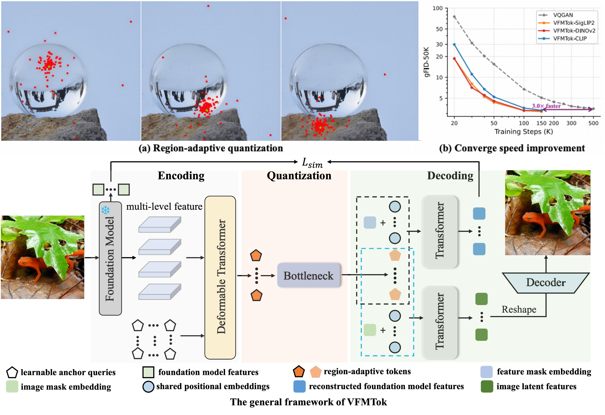

# Vision Foundation Models as Generalist Tokenizers for Image Generation <br><sub>Official PyTorch Implementation</sub>

[](https://arxiv.org/abs/2605.18390)&nbsp;
[](https://huggingface.co/yexiguafu/VFMTok)&nbsp;


<p align="center">

<p>

This is a PyTorch/GPU implementation of the paper **Vision Foundation Models as Generalist Tokenizers for Image Generation**, which is a further extension of the previous work **Vision Foundation Models as Effective Visual Tokenizers for Autoregressive Image Generation**. This work builds upon the idea of previous work, which directly **utilizes features from the frozen pre-trained vision foundation model (VFM) to reconstruct the original image**. However, the previous work only built a discrete tokenizer based on VFM for autoregressive (AR) image synthesis, leaving continuous-valued image reconstruction and generation under-explored. 

To this end, we extend this idea to the continuous-valued domain and devised a new continuous-valued tokenizer, dubbed **VFMAE**, for both image reconstruction and generation in continuous space. In addition to retaining the original two key components introduced in the previous work — **region-adaptive sampling** to reduce redundancy in the latent feature and the **semantic reconstruction objective** to preserve semantic fidelity, we also thoroughly investigated the optimal architecture for continuous-valued image reconstruction and generation.

Similarly, for continuous-space generation, integrating **VFMAE** with a denoising model yields an exceptional gFID of **1.25** and enables high-fidelity class-conditional synthesis without classifier-free guidance (w/o CFG). Beyond these remarkable empirical results, we systematically investigate the underlying mechanisms of **VFMTok/VFMAE** and discovered that the specific self-supervised learning objectives utilized during VFM pre-training dictate its effectiveness as a tokenizer. Specifically, **a VFM jointly optimized with global contrastive learning and latent masked image modeling** provides the optimal representations for image tokenization.

This repo contains:

* 🪐 A simple PyTorch implementation of VFMTok/VFMAE and various generative models in both discrete and continuous space.
* ⚡️ Pre-trained tokenizer: VFMTok/VFMAE and autoregressive and denoising generative models trained on ImageNet.
* 🛸 Training and evaluation scripts for tokenizer and generative models, which were also provided in [here](./scripts).
* 🎉 Hugging Face for easy access to pre-trained models.


## Release
<!-- - [2026/05/19] 🔥 ** VFMTok ** -->
- [2025/07/11] 🔥 Discrete **VFMTok** for AR generation has been released. Checkout the [paper](https://arxiv.org/pdf/2507.08441) for details.🔥
- [2025/09/18] 🔥 **VFMTok has been accepted by NeurIPS 2025!** 🔥
- [2025/10/11] 🔥 [Image tokenizers](https://huggingface.co/yexiguafu/VFMTok/tree/main/DINOv2/tokenizer) and [AR models](https://huggingface.co/yexiguafu/VFMTok/tree/main/DINOv2) for class-conditional image generation are released. 🔥
- [2025/10/11] 🔥 All codes of VFMTok have been released. 🔥
- [2026/05/20] 🔥 Continuous-valued [VFMAE](https://huggingface.co/yexiguafu/VFMTok/tree/main/tokenizer) for [denoising generative models](https://huggingface.co/yexiguafu/VFMTok/tree/main/DiTDH-XL) has been released, Checkout the [paper](https://arxiv.org/pdf/2605.18390v1) for details. 🔥

## Contents
- [Install](#install)
- [Model Zoo](#model-zoo)
- [Performance](#performance)
- [Train](#train)
- [Evaluation](#evaluation)

## Install

If you are not using Linux, do *NOT* proceed.

1. Clone this repository and navigate to VFMTok2 folder
```bash
git clone https://github.com/CVMI-Lab/VFMTok2.git
cd VFMTok2
```

2. Create the vfmtok2 environment
```Shell
conda create -n vfmtok2 python=3.10 -y
conda activate vfmtok2
```

3. Install deformable attention module
```
cd commons/modules/ops
bash make.sh
```

## Model Zoom

In this repo, we release:
* Town image tokenizers: disrete **VFMTok(DINOv2)** and continuous-valued **VFMAE(DINOv2)**
* Class-conditional autoregressive generative models ranging from **111M** to **3B** parameters.
* Class-conditional denoising generative models **DiTDH-XL**, whose architecture is inheretted from [RAE](https://arxiv.org/pdf/2510.11690).

### 1. tokenizer models
In this repo, we release two image tokenizer: VFMTok(DINOv2) and VFMAE(DINOv2). They directly utilizes the features from the frozen pre-trained VFM -- DINOv2, to reconstruct the image. Besides, we also designs 2 key components: **region-adaptive sampling** and **semantic reconstruction** to reduce the redundancy in the pretrained features and maintain the semantic fidelity, respectively.

Method | tokens | rFID (256x256) | rIS (256x256) |PSNR | SSIM   | weight
---    | :---:  |:---:|:---: | :---: | :---:  | :---: 
VFMTok |  256   | 0.98 | 215.4  | 20.6 | 0.67 | [vfmtok-tokenizer.pt](https://huggingface.co/yexiguafu/VFMTok/blob/main/DINOv2/tokenizer/vfmtok-tokenizer.pt)
VFMAE  |  256   | 0.29 | 225.6  | 25.5 | 0.82 | [vfmae-tokenizer.pt](https://huggingface.co/yexiguafu/VFMTok/blob/main/tokenizer/vfmae-tokenizer.pt)

### 2. AR generation models with classifier-free guidance (CFG).
Once the trained VFMTok(DINOv2) is integrated into autoregressive (AR) generative models, it ahieves notable image generation performance.

Method   | params | epochs | FID | sFID |  IS  | Pre. | Rec. |
---      | :---:  | :---:  | :---:| :---: |:---: | :---:|:---:|
[VFMTok-B](https://huggingface.co/yexiguafu/VFMTok/blob/main/DINOv2/GPT-B/GPT-B-300e.pt)  | 111M   |  300   | 3.43 | 5.88 | 252.2 | 0.85 | 0.53 |
[VFMTok-L](https://huggingface.co/yexiguafu/VFMTok/blob/main/DINOv2/GPT-L/GPT-L-300e.pt)  | 343M   |  300   | 2.76 | 5.69 | 276.1 | 0.84 | 0.57 |
[VFMTok-XL](https://huggingface.co/yexiguafu/VFMTok/blob/main/DINOv2/GPT-XL/GPT-XL-200e.pt) | 775M   |  200   | 2.38 | 5.54 | 277.2 | 0.83 | 0.60 |
[VFMTok-XXL](https://huggingface.co/yexiguafu/VFMTok/blob/main/DINOv2/GPT-XXL/GPT-XXL-200e.pt)| 1.4B   |  200   | 2.28 | 5.49 | 274.3 | 0.83 | 0.60 |
[VFMTok-2B](https://huggingface.co/yexiguafu/VFMTok/blob/main/DINOv2/GPT-2B/GPT-2B-200e.pt) | 2.0B   |  200   | 2.27 | 5.56 | 283.6 | 0.82 | 0.61 |
[VFMTok-3B](https://huggingface.co/yexiguafu/VFMTok/blob/main/DINOv2/GPT-3B/GPT-3B-200e.pt) | 3.1B   |  200   | 2.07 | 5.46 | 280.4 | 0.82 | 0.61 |

### 3. AR generation without CFG.
The trained VFMTok(DINOv2), when integrated into the AR generation models, can also achieve impressive image generation quality without CFG-guidance (CFG-free guidance).

Method   | params | epochs | FID | sFID |  IS  | Pre. | Rec. |
---      | :---:  | :---:  | :---:| :---: |:---: | :---:|:---:|
[VFMTok-B](https://huggingface.co/yexiguafu/VFMTok/blob/main/DINOv2/GPT-B/GPT-B-300e.pt) | 111M   |  300   | 3.09 | 5.67 | 173.6 | 0.80 | 0.58 |
[VFMTok-L](https://huggingface.co/yexiguafu/VFMTok/blob/main/DINOv2/GPT-L/GPT-L-300e.pt)  | 343M   |  300   | 2.15 | 5.44 | 230.1 | 0.82 | 0.60 |
[VFMTok-XL](https://huggingface.co/yexiguafu/VFMTok/blob/main/DINOv2/GPT-XL/GPT-XL-200e.pt) | 775M   |  200   | 2.06 | 5.59 | 257.2 | 0.82 | 0.61 |
[VFMTok-XXL](https://huggingface.co/yexiguafu/VFMTok/blob/main/DINOv2/GPT-XXL/GPT-XXL-200e.pt) | 1.4B   |  200   | 2.09 | 5.48 | 259.3 | 0.82 | 0.61 |
[VFMTok-2B](https://huggingface.co/yexiguafu/VFMTok/blob/main/DINOv2/GPT-2B/GPT-2B-200e.pt) | 2.0B   |  200   | 2.20 | 5.54 | 279.7 | 0.82 | 0.61 |
[VFMTok-3B](https://huggingface.co/yexiguafu/VFMTok/blob/main/DINOv2/GPT-3B/GPT-3B-200e.pt)| 3.1B   |  200   | 2.04 | 5.43 | 267.8 | 0.82 | 0.61 |

### 4. Denoising generation with CFG ([AutoGuidance](https://arxiv.org/pdf/2406.02507)).
Method   | params | epochs | FID | sFID |  IS  | Pre. | Rec. |
---      | :---:  | :---:  | :---:| :---: |:---: | :---:|:---:|
[DiTDH-XL(VFMAE)](https://huggingface.co/yexiguafu/VFMTok/blob/main/DiTDH-XL/DiTDH-XL_80e.pt) | 839M | 80 | 1.68 | 6.10 | 217.5|  0.74| 0.68|
[DiTDH-XL(VFMAE)](https://huggingface.co/yexiguafu/VFMTok/blob/main/DiTDH-XL/DiTDH-XL_80e.pt) | 839M |800 | 1.25 | 5.84 | 294.0|  0.77| 0.69|

### 5, Denosing generation without CFG.
Method   | params | epochs | FID | sFID |  IS  | Pre. | Rec. |
---      | :---:  | :---:  | :---:| :---: |:---: | :---:|:---:|
[DiTDH-XL(VFMAE)](https://huggingface.co/yexiguafu/VFMTok/blob/main/DiTDH-XL/DiTDH-XL_80e.pt) | 839M | 80 |3.29 | 6.17 | 176.5 | 0.75 | 0.64|
[DiTDH-XL(VFMAE)](https://huggingface.co/yexiguafu/VFMTok/blob/main/DiTDH-XL/DiTDH-XL_800e.pt) | 839M |800 |1.65 | 5.78 | 240.9 |0.76  | 0.67|

## Training

### 1. Preparation

1. Download the [DINOv2-L](https://dl.fbaipublicfiles.com/dinov2/dinov2_vitl14/dinov2_vitl14_reg4_pretrain.pth) pre-trained foundation model from the official [model zoo](https://github.com/facebookresearch/dinov2).
2. Create symbolic links that point from the locations of the pretrained DINOv2-L model and the ImageNet training dataset folders to this directory.
3. Create dataset script for your own dataset. Here, we provide a template for training tokenizers and AR generative models using the ImageNet dataset in [LMDB](https://www.symas.com/mdb) format.

```bash
ln -s DINOv2-L_folder init_models
ln -s ImageNetFolder imagenet
```

### 2.VFMTok Training

1. Training VFMTok(DINOv2) tokenizer (see ```scripts/tokenizer/train_tok.sh```):

```bash
export NODE_COUNT=1
export NODE_RANK=0
export PROC_PER_NODE=8 # see tokenizer/utils/vqgan_train.py
scripts/autoregressive/torchrun.sh vqgan_train.py  --image-size 336 --results-dir output --mixed-precision bf16 --embed-dim 12    \
    --data-path imagenet/lmdb/train_lmdb --global-batch-size 16 --num-workers 4 --ckpt-every 5000 --epochs 50 \
    --transformer-config configs/vfmtok/vfmtok_config.yaml --log-every 1 --lr 1e-4 --ema --z-channels 512
```


2. Training VFMAE(DINOv2) tokenizer (see ```scripts/tokenizer/train_ae.sh```):

```bash
export NODE_COUNT=1
export NODE_RANK=0
export PROC_PER_NODE=8
export MASTER_PORT=12333
export MASTER_ADDR=localhost # see tokenizer/utils/ae_train.py
scripts/autoregressive/torchrun.sh  \ 
    ae_train.py  --image-size 256 --results-dir output --mixed-precision none --global-batch-size 256 --num-workers 4  \
    --data-path imagenet/lmdb/train_lmdb --ckpt-every 5000 --transformer-config configs/vfmae/vfmae_config.yaml  \
    --epochs 50 --log-every 1 --lr 1e-4 --ema --z-channels 512 --embed-dim 32 --disc-start 20000 
```

3. Calculating encoder statistics (mean/variance) for VFMAE (see ```scripts/denoise/compute_stats.sh```)
```bash
export NODE_COUNT=1
export NODE_RANK=0
export PROC_PER_NODE=8
scripts/autoregressive/torchrun.sh  \
        compute_stats.py --ae-model AE-16 --image-size 256 --batch-size 50 --embed-dim 32 --z-channels 512     \
        --anno-file imagenet/lmdb/train_lmdb --ae-ckpt DINOv2/tokenizer/vfmae-tokenizer.pt
```

### 3. AR generative model training

1. Training AR generative models (see ```scripts/autoregressive/run_train.sh```)

```bash
export NODE_COUNT=1
export NODE_RANK=0
export PROC_PER_NODE=8
export MASTER_PORT=12333
export MASTER_ADDR=localhost 
model_type='GPT-L' # 'GPT-B' 'GPT-XL' 'GPT-XXL' 'GPT-2B'
scripts/autoregressive/torchrun.sh train_c2i.py --gpt-type c2i --image-size 336 --gpt-model ${model_type} --downsample-size 16 --num-workers 4   \
    --anno-file imagenet/lmdb/train_lmdb --global-batch-size 512 --ckpt-every 10000 --ema --log-every 1 --results-dir output \
    --vq-model VQ-16 --vq-ckpt tokenizer/vfmtok-tokenizer.pt --latent-size 16 --mixed-precision bf16 --epochs 300
```

2. Resume from an AR generative checkpoint
```bash
export NODE_COUNT=1
export NODE_RANK=0
export PROC_PER_NODE=8
export MASTER_PORT=12333
export MASTER_ADDR=localhost 
model_type='GPT-L'
scripts/autoregressive/torchrun.sh train_c2i.py --gpt-type c2i --image-size 336 --gpt-model ${model_type} --downsample-size 16 --num-workers 4   \
    --anno-file imagenet/lmdb/train_lmdb --global-batch-size 512 --ckpt-every 10000 --ema --log-every 1 --results-dir output \
    --vq-model VQ-16 --vq-ckpt tokenizer/vfmtok-tokenizer.pt --latent-size 16 --mixed-precision bf16 --epochs 300 \
    --gpt-ckpt output/vanilla/${model_type}/${model_type}-{ckpt_name}.pt
```

### 4. Denoising model training
1. Training denoising generative models (see ```scripts/denoise/run_train.sh```)
```bash
export NODE_COUNT=1
export NODE_RANK=0
export PROC_PER_NODE=8
export MASTER_PORT=22331
export MASTER_ADDR=localhost
config_file='configs/denoise/training/ImageNet256/DiTDH-XL_DINOv2-B.yaml'
scripts/autoregressive/torchrun.sh train_c2i.py --config ${config_file} --data-path imagenet/lmdb/train_lmdb       \
    --image-size 256 --results-dir output/snapshot --precision fp32 --embed-dim 32  --z-channels 512      \
    --ae-ckpt DINOv2/tokenizer/vfmae-tokenizer.pt --stats-file stats/stats-500.pt --compile --ckpt ${RESUME_CKPT}
```

2. Resume from a denoising generative model
```bash
export NODE_COUNT=$1
export NODE_RANK=$2
export PROC_PER_NODE=8
export MASTER_PORT=22331
export MASTER_ADDR=localhost
config_file='configs/denoise/training/ImageNet256/DiTDH-XL_DINOv2-B.yaml'
scripts/autoregressive/torchrun.sh train_c2i.py --config ${config_file} --data-path imagenet/lmdb/train_lmdb       \
    --image-size 256 --results-dir output/snapshot --precision fp32 --embed-dim 32  --z-channels 512      \
    --ae-ckpt DINOv2/tokenizer/vfmae-tokenizer.pt --stats-file stats/stats-500.pt --compile       \
```
### 5. Evaluation (ImageNet 256x256)

1. Evaluated a pretrained discrete tokenizer VFMTok (see ```scripts/tokenizer/test_tok.sh```):

```bash
scripts/autoregressive/torchrun.sh vqgan_test.py --vq-model VQ-16 --image-size 336 --output_dir recons --batch-size $1   \
        --z-channels 512 --vq-ckpt tokenizer/vfmtok-tokenizer.pt --transformer-config-file configs/vfmtok/vfmtok_config.yaml --embed-dim 12
```


2. Evaluate a pretrained continuous-valued tokenizer - VFMAE (see ```scripts/tokenizer/test_ae.sh```)
```bash
export NODE_COUNT=1
export NODE_RANK=0
export PROC_PER_NODE=8
export MASTER_PORT=65331
scripts/autoregressive/torchrun.sh ae_test.py --transformer-config-file configs/vfmae/vfmae_config.yaml --image-size 256 \
        --batch-size $1 --anno-file imagenet/lmdb/val_lmdb --ae-ckpt DINOv2/tokenizer/vfmae-tokenizer.pt --embed-dim 32
```

3. Evaluate a pretrained AR generative model (see ```scripts/autoregressive/run_test.sh```)

```bash
model_type='GPT-L' # 'GPT-B' 'GPT-XL' 'GPT-XXL' 'GPT-2B'
scripts/autoregressive/torchrun.sh test_c2i.py --vq-ckpt DINOv2/tokenizer/vfmtok-tokenizer.pt            \
    --gpt-ckpt DINOv2/${model_type}/${model_type}-$1e.pt --compile --gpt-model ${model_type} --image-size 336 \
    --sample-dir samples --image-size-eval 256 --cfg-scale $2 --precision bf16 --per-proc-batch-size $3   \
    --embed-dim 12 --latent-size 16
```

4. Evaluated a pretrained denoising generative model (see ```scripts/denoise/run_test.sh```)
```bash
saveDir='samples'
mkdir -p ${saveDir}
model_name='DiTDH-XL-$1e.pt'
cfg_file='configs/denoise/sampling/ImageNet256/DiTDHXL-DINOv2-B_AG.yaml'
scripts/autoregressive/torchrun.sh test_net.py --config ${cfg_file} --compile --sample-dir ${saveDir} --precision bf16  \
    --label-sampling equal --ckpt output/sota/${model_name}.pt --per-proc-batch-size $2 --embed-dim 32      \
    --stats-file stats/stats-500.pt --ae-ckpt DINOv2/tokenizer/vfmae-tokenizer.pt --cfg-scale $3
```

## Citation

If you find VFMTok useful for your research and applications, please kindly cite using this BibTeX:
```
@article{vfm-genralist,
  title={Vision Foundation Models as Generalist Tokenizers for Image Generation},
  author={Zheng, Anlin and Han, Qi and Wen, Xin and Ma, Chuofan and Gong, Lanxi and Yu, Gang and Zhang, Xiangyu and Qi, Xiaojuan},
  journal={arXiv preprint arXiv:2605.18390},
  year={2026}
}

```

## License
The majority of this project is licensed under Apacha 2.0 License. Portions of the project are available under separate license of referred projects, detailed in corresponding files.


## Acknowledgement

Our codebase builds upon several excellent open-source projects, including [LlamaGen](https://github.com/FoundationVision/LlamaGen), [Deformable DETR](https://github.com/fundamentalvision/Deformable-DETR), [Hita](https://github.com/CVMI-Lab/Hita), [Paintmind](https://github.com/Qiyuan-Ge/PaintMind) and [RAE](https://github.com/bytetriper/RAE). We are grateful to the communities behind them.

## Contact
This codebase has been cleaned up but has not undergone extensive testing. If you encounter any issues or have questions, please open a GitHub issue. We appreciate your feedback!
